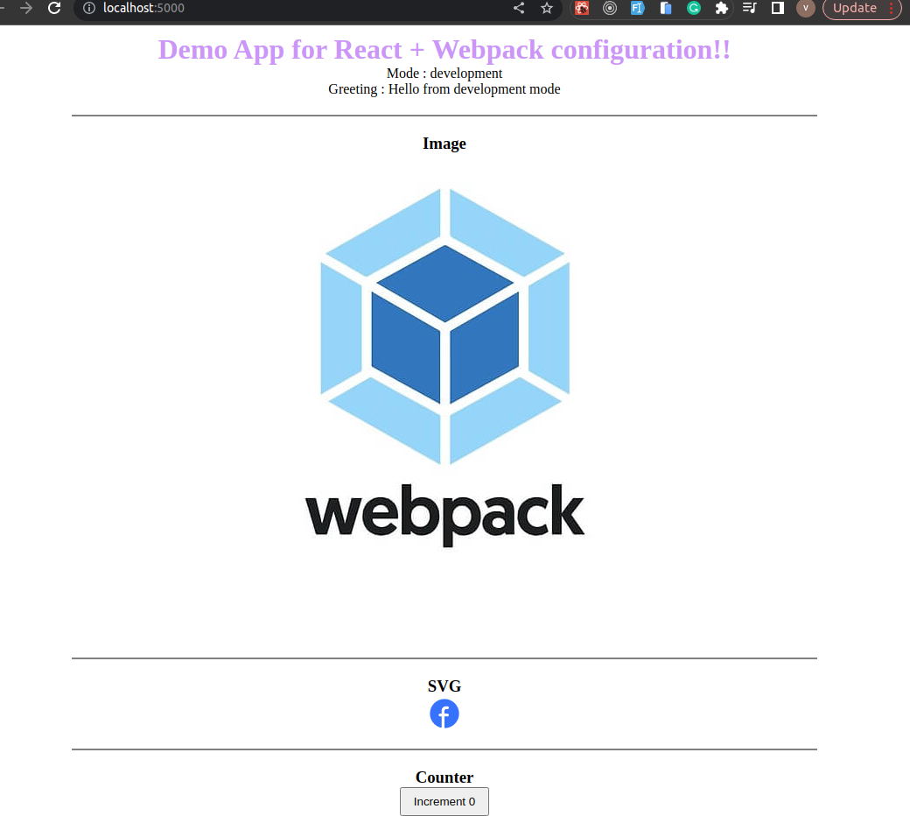

# Webpack-demo

This project is specifically crafted for seamless Webpack configuration. The configuration includes Webpack, Babel, ESLint, Prettier, Husky for Git hooks, and comprehensive TypeScript support. The project is structured to cater to both development and production environments.

### Step by Step guide : [Documentation by me](https://www.notion.so/Webpack-c5cac16b34e6482280a381cdbb94fe4e)

---

## Technology Overview :

1. **Webpack**

   - `Webpack` is a bundler that uses a dependency graph to bundle our code and assets (including static assets such as images) into a ‘bundle’ that we can then deploy.

2. **Babel**

   - `Babel` is a transpiler,this means you can write your JavaScript using the latest features the language has to offer and Babel will compile your code into JavaScript that will run without issues on most browsers.

3. **ESLint:**

   - `ESLint` is a static code analysis tool. It is like a code quality assistant. It helps you catch and fix mistakes in your JavaScript code.

4. **Prettier:**

   - `Prettier` is like an automatic code beautifier. It takes your messy code and makes it look nice and tidy automatically.

5. **Husky:**

   - `Husky` is a tool that integrates with your Git workflow by allowing you to set up Git hooks easily. Git hooks are scripts that run at different points in the Git lifecycle, such as before a commit (`pre-commit`), before a push (`pre-push`), etc. These hooks enable you to execute custom actions or checks before or after specific Git operations.

   - `lint-staged` is like a quality checker for your code that
     runs right before you make a commit. It looks at the files you're about to commit. It helps ensure that your code meets
     certain standards and doesn't introduce any common mistakes before you save it to the version control system.

---

## Getting Started :

1. Clone the repository:

   ```bash
   git clone https://github.com/vanshitaa-shah/webpack-demo.git
   ```

2. Navigate to the webpack-demo directory and install dependencies:

   ```bash
   cd webpack-demo
   npm install
   ```

3. For development environment :

   ```bash
   npm start
   ```

4. For production environment :

   ```bash
   npm run build //It will create a build folder
   serve -s build
   ```

---

## Output:

- Development environment:

  

- Production environment:

  

---

## Learn more

Explore the documentation to deepen your understanding

[webpack](https://webpack.js.org/concepts/)

[Documentation by me](https://www.notion.so/Webpack-c5cac16b34e6482280a381cdbb94fe4e)

---

## Git Strategy

**Branches** :

- Main
- Dev
- Feature
